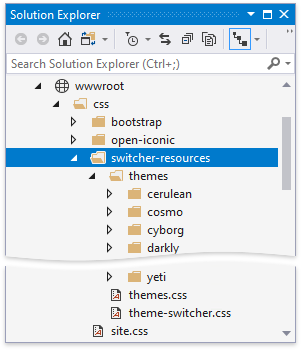

<!-- default badges list -->

[](https://supportcenter.devexpress.com/ticket/details/T845557)
[](https://docs.devexpress.com/GeneralInformation/403183)
<!-- default badges end -->
# How to implement a Theme Switcher in Blazor applications

This example demonstrates how to create a Theme Switcher as in [DevExpress Blazor Demos](https://demos.devexpress.com/blazor/) and apply the selected theme to an application at runtime. The Theme Switcher includes the standard Bootstrap theme, [DevExpress built-in themes](https://github.com/DevExpress/bootstrap-themes), and [free Bootswatch themes](https://bootswatch.com/).


The example includes solutions both for Blazor Server and Blazor WebAssembly hosting models. Note that these solutions target .NET 6.0.

## Overview

Follow the steps below to implement a Theme Switcher in your application:

1. Use a [DevExpress Project Template](https://docs.devexpress.com/Blazor/401057/get-started) to create a new Blazor Server or Blazor WebAssembly application.

2. Copy this example's [switcher-resources](https://github.com/DevExpress-Examples/blazor-theme-switcher/tree/22.2.3%2B/CS/BlazorServer/switcher/switcher/wwwroot/css/switcher-resources) folder to your application's *wwwroot/css* folder. The *switcher-resources* folder has the following structure:

    * The *themes* folder includes nested folders whose names correspond to Bootstrap theme names. Each nested folder stores a Bootstrap theme's stylesheet (the *bootstrap.min.css* file).
    * The *themes.css* file contains CSS rules used to draw colored squares for each theme in the Theme Switcher.
    * The *theme-switcher.css* file contains CSS rules that define the Theme Switcher's settings and behavior.

    

3. Link the *themes.css* and *theme-switcher.css* files in the *site.css* file (for Blazor Server) or the *app.css* file (for Blazor WebAssembly):

    ```CSS
    @import url('switcher-resources/themes.css');
    @import url('switcher-resources/theme-switcher.css');
    // ...
    ```

4. Create the *Utils.cs* file in the *Shared* folder. In the newly created file, list DevExpress themes that you want to switch between:
   
    ```csharp
    namespace switcher.Shared {
        public static class Utils {
            public static readonly string[] DevExpressThemes = { "blazing-berry", "purple", "office-white", "blazing-dark" };
        }
    }
    ```

5. In the same folder, create the *ThemeItem.cs* file. In this file, define a custom type to store a theme name and URLs of stylesheets used to apply this theme:
   
    ```csharp
    using System;
    namespace switcher.Shared {
        public record ThemeItem(string Name, string[] StylesheetLinkUrl) {
            public static readonly ThemeItem Default = Create("default");
            public static ThemeItem Create(string name) {
                
                if (Utils.DevExpressThemes.Contains(name))
                    return new ThemeItem(name, new[] { $"_content/DevExpress.Blazor.Themes/{name}.bs5.min.css" });
                return new ThemeItem(name, new[] { "_content/DevExpress.Blazor.Themes/bootstrap-external.bs5.min.css", $"css/switcher-resources/themes/{name}/bootstrap.min.css" });
            }
        };
    }
    
    ```

6. Create the *ThemeSwitcherSideView.razor* component in the *Shared* folder. In the component file, declare the following:
   
    * Variables that specify the visibility of the theme selector panel (`Visible`) and the current theme (`ActiveTheme`).
    * Event callbacks (`VisibleChanged` and `ActiveThemeChanged`) that update the state of the parent component after you select another theme. Refer to the Microsoft documentation for more information: [Binding with Component Parameters](https://docs.microsoft.com/en-us/aspnet/core/blazor/components/data-binding#binding-with-component-parameters).
    * A theme collection that stores all themes available in the Theme Switcher (`GroupedThemes`).
   
    ```razor
    @* ... *@
    @code {
        static readonly Dictionary<string, string[]> GroupedThemes = new() {
                ["Color Themes"] = new[] { "default" },
                ["DevExpress Themes"] = Utils.DevExpressThemes,
                ["Bootswatch Themes"] = new[] {
                "cerulean", "cosmo", "cyborg", "darkly", "flatly", "journal", "litera",
                "lumen", "lux", "materia", "minty", "pulse", "sandstone", "simplex", "sketchy", "slate",
                "solar", "spacelab", "superhero", "united", "yeti"
            }
            };
     
        [Parameter] public bool Visible { get; set; }
        [Parameter] public EventCallback<bool> VisibleChanged { get; set; }
        [Parameter] public ThemeItem ActiveTheme { get; set; }
        [Parameter] public EventCallback<ThemeItem> ActiveThemeChanged { get; set; }
        @* ... *@
    }
    ```

7. To display icons for each theme in the Theme Switcher, add the sidebar's layout into the *ThemeSwitcherSideView.razor* file:

    ```razor
    @if (Visible) {
        <nav id="themesMenu">
            <ul class="nav nav-pills">
                @foreach (var themeSet in GroupedThemes) {
                    <li class="nav-item theme-group">@themeSet.Key</li>
                    @foreach (var theme in themeSet.Value) {
                        <li class="nav-item">
                            <a class="nav-link @(ActiveTheme.Name == theme ? "active" : "") "
                   href="#"
                   @onclick=@(async(e) => await OnItemClick(theme))
                   @onclick:preventDefault>
                                <span class="image @theme.ToLower().Replace(" ", "-")" aria-hidden="true"></span>
                                <span class="theme-name">@theme</span>
                            </a>
                        </li>
                    }
                }
            </ul>
        </nav>
    }
    ```

8. In the same file, handle the active theme changes. This example uses [JavaScript Interop](https://docs.microsoft.com/en-us/aspnet/core/blazor/call-javascript-from-dotnet) to fetch external resources when you click a theme tile:

    ```razor
    @inject IJSRuntime JSRuntime
    @* ... *@
    @code {
    @* ... *@
        [Parameter] public bool Visible { get; set; }
        [Parameter] public EventCallback<bool> VisibleChanged { get; set; }
        [Parameter] public ThemeItem ActiveTheme { get; set; }
        [Parameter] public EventCallback<ThemeItem> ActiveThemeChanged { get; set; }
        async Task OnItemClick(string theme) {
            if (ActiveTheme.Name != theme) {
                var themeItem = ThemeItem.Create(theme);
                foreach (string stylesheetLinkUrl in themeItem.StylesheetLinkUrl)
                    await JSRuntime.InvokeVoidAsync("fetch", stylesheetLinkUrl, new {
                        method = "GET",
                        mode = "no-cors"
                    });
                await Task.WhenAll(
                    ActiveThemeChanged.InvokeAsync(themeItem),
                    VisibleChanged.InvokeAsync(false)
                );
            }
        }
    }
    ```

9. Create the *ThemeSwitcherToggleButton.razor* component in the *Shared* folder. In the component file, declare the `Active` variable and `ActiveChanged` event callback to allow data binding. Add the toggle button's HTML markup that reflects the `Active` variable's value and invokes the `ActiveChanged` event callback after you click the button.
   
    ```razor
    <div align="right" class="theme-settings @Active">
        <a class="nav-item nav-link" @onclick="@OnClick" @onclick:preventDefault href="#">
            <span class="oi oi-cog"></span>
        </a>
    </div>
    
    @code {
        [Parameter] public bool Active { get; set; }
        [Parameter] public EventCallback<bool> ActiveChanged { get; set; }
        async Task OnClick() {
            await ActiveChanged.InvokeAsync(!Active);
        }
    }
    ```

10. Define the Theme Switcher UI in the *MainLayout.razor* file. Use two-way binding to bind the `ActiveTheme` property of the **ThemeSwitcherSideView** component to the active theme. The `@key` directive attribute allows you to guarantee preservation of elements or components based on the key's value.
    
    ```razor
    @inherits LayoutComponentBase
       
    <HeadContent>
        @foreach(var item in _activeTheme.StylesheetLinkUrl) {
            <link href="@item" rel="stylesheet" />
        }
    </HeadContent>
    <div class="main">
        <ThemeSwitcherToggleButton @bind-Active=@_themeSwitcherShown />
        <div id="settingsbar" class="@(_themeSwitcherShown ? "" : "hidden-settings-bar")">
            <ThemeSwitcherSideView @bind-ActiveTheme="@_activeTheme" @bind-Visible="@_themeSwitcherShown" />
        </div>
        <div class="content px-4" @key=@_activeTheme>
            @Body
        </div>
    </div>
    
    @code {
        bool _themeSwitcherShown = false;
        ThemeItem _activeTheme = ThemeItem.Default;
    }
    ```

11. Remove the default theme's stylesheet (`<link href="_content/DevExpress.Blazor.Themes/{your-default-theme-name}.bs5.css" rel="stylesheet" />`) from the `<head>` section of the *Pages/_Layout.cshtml* file (for Blazor Server) or the *wwwroot/index.html* file (for Blazor WebAssembly).

12. Open the *Index.razor* file and add the [DxGrid](https://docs.devexpress.com/Blazor/DevExpress.Blazor.DxGrid) component:
    
    ```razor
    @page "/"
    @using switcher.Data
    @inject WeatherForecastService ForecastService
        
    <DxGrid Data="@forecasts"
            PageSize="5"
            ShowFilterRow="false"
            @bind-SelectedDataItems="@SelectedDataItems">
        <Columns>
            <DxGridSelectionColumn />
            <DxGridDataColumn FieldName="@nameof(WeatherForecast.TemperatureC)" Caption="@("Temp. (\x2103)")" TextAlignment="@GridTextAlignment.Right"></DxGridDataColumn>
            <DxGridDataColumn FieldName="@nameof(WeatherForecast.TemperatureF)" Caption="@("Temp. (\x2109)")"></DxGridDataColumn>
            <DxGridDataColumn FieldName="@nameof(WeatherForecast.Date)" DisplayFormat="D"></DxGridDataColumn>
        </Columns>
    </DxGrid>
    
    @code {
        WeatherForecast[] forecasts;
        IReadOnlyList<object> SelectedDataItems { get; set; }
    
        protected override async Task OnInitializedAsync() {
            forecasts = await ForecastService.GetForecastAsync(DateTime.Today);
            SelectedDataItems = forecasts.Where(f => f.Date == DateTime.Today.AddDays(1)).ToList();       
            System.Threading.Thread.Sleep(3000);
        }
    }
    
    ```

This example uses the `HeadOutlet` component. Refer to the following Microsoft article for more information: [HeadOutlet Component](https://docs.microsoft.com/en-us/aspnet/core/blazor/components/control-head-content#headoutlet-component).

<!-- default file list -->
## Files to Review

**Blazor Server**
* [ThemeSwitcherSideView.razor](./CS/BlazorServer/switcher/switcher/Shared/ThemeSwitcherSideView.razor)
* [ThemeItem.cs](./CS/BlazorServer/switcher/switcher/Shared/ThemeItem.cs)
* [MainLayout.razor](./CS/BlazorServer/switcher/switcher/Shared/MainLayout.razor)
* [Index.razor](./CS/BlazorServer/switcher/switcher/Pages/Index.razor)
* [switcher-resources](./CS/BlazorServer/switcher/switcher/wwwroot/css/switcher-resources) (folder)

**Blazor WebAssembly**
* [ThemeSwitcherSideView.razor](./CS/BlazorWeb Assembly/switcher/switcher/Shared/ThemeSwitcherSideView.razor)
* [ThemeItem.cs](./CS/BlazorWeb Assembly/switcher/switcher/Shared/ThemeItem.cs)
* [MainLayout.razor](./CS/BlazorWeb Assembly/switcher/switcher/Shared/MainLayout.razor) 
* [Index.razor](./CS/BlazorWeb Assembly/switcher/switcher/Pages/Index.razor)  
* [switcher-resources](./CS/BlazorWeb Assembly/switcher/switcher/wwwroot/css/switcher-resources) (folder)
<!-- default file list -->

## Documentation

* [Themes](https://docs.devexpress.com/Blazor/401523/common-concepts/themes)
