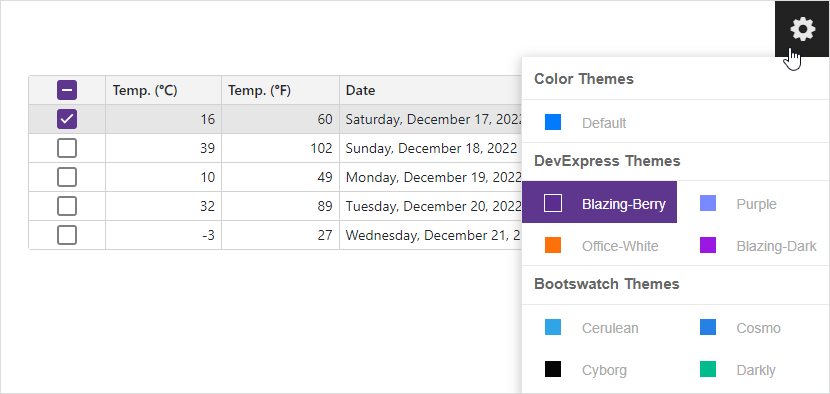

<!-- default badges list -->

[](https://supportcenter.devexpress.com/ticket/details/T845557)
[](https://docs.devexpress.com/GeneralInformation/403183)
[](#does-this-example-address-your-development-requirementsobjectives)
<!-- default badges end -->
# How to implement a Theme Switcher in Blazor applications

This example demonstrates how to add a Theme Switcher to your application. The switcher in this example is the same as in [DevExpress Blazor Demos](https://demos.devexpress.com/blazor/). It allows users to switch between [DevExpress built-in themes](https://docs.devexpress.com/Blazor/401523/common-concepts/customize-appearance/themes) and external Bootstrap themes (the default theme and [free Bootswatch options](https://bootswatch.com/)).




The example's solution targets .NET 8, but you can also integrate this Theme Switcher in projects that target .NET 6 and .NET 7.

## Add a Theme Switcher to an Application

Follow the steps below to add a Theme Switcher into your application:

1. Copy this example's [ThemeSwitcher](./CS/switcher/switcher/ThemeSwitcher) folder to your project.
2. In the *_Imports.razor* file, import the `switcher.ThemeSwitcher` namespace and files located in the *ThemeSwitcher* folder:

    ```cs
    @using <YourProjectName>.ThemeSwitcher
    @using switcher.ThemeSwitcher
    ```

3. Copy this example's [switcher-resources](./CS/switcher/switcher/wwwroot/switcher-resources) folder to your application's *wwwroot* folder. The *switcher-resources* folder has the following structure:

    * **css/themes**  
    Includes nested folders whose names correspond to external Bootstrap themes. Each nested folder stores an external theme's stylesheet (*bootstrap.min.css*). Note that built-in DevExpress themes are added to the application with DevExpress Blazor components and stored separately in the **DevExpress.Blazor.Themes** NuGet package.

    * **css/themes.css**  
    Contains CSS rules used to draw colored squares for each theme in the Theme Switcher.
    * **css/theme-switcher.css**  
    Contains CSS rules that define the Theme Switcher's appearance and behavior.
    * **theme-controller.js**  
    Contains functions that add and remove links to theme stylesheets.
    * **theme.svg**  
    An icon displayed in the Theme Switcher.

4. In the layout file, use the [HttpContextAccessor](https://learn.microsoft.com/en-us/dotnet/api/microsoft.aspnetcore.http.httpcontextaccessor?view=aspnetcore-8.0) class to obtain the current theme from cookies:
    ```html
    @using Microsoft.AspNetCore.Mvc.ViewFeatures
    @inject IFileVersionProvider FileVersionProvider
    @inject ThemeService Themes
    @inject Microsoft.AspNetCore.Http.IHttpContextAccessor HttpContextAccessor
    @{
        string? InitialThemeName = HttpContextAccessor.HttpContext?.Request.Cookies["ActiveTheme"];
        Themes.SetActiveThemeByName(InitialThemeName);
        var bsTheme = Themes.GetBootstrapThemeCssUrl(Themes.ActiveTheme);
        var dxTheme = Themes.GetThemeCssUrl(Themes.ActiveTheme);
        var hlTheme = Themes.GetHighlightJSThemeCssUrl(Themes.ActiveTheme);

        string AppendVersion(string path) => FileVersionProvider.AddFileVersionToPath("/", path);
    }
    ```
5. In the `head` section of the layout file, replace a link to a theme stylesheet with the following code:
    ```html
    <head>
       @if (!string.IsNullOrEmpty(bsTheme)) {
            <link rel="stylesheet" href="@AppendVersion(bsTheme)" bs-theme-link />
        }
        @if (!string.IsNullOrEmpty(dxTheme)) {
            <link rel="stylesheet" href="@AppendVersion(dxTheme)" dx-theme-link />
        }
        @if (!string.IsNullOrEmpty(hlTheme)) {
            <link rel="stylesheet" href="@hlTheme" hl-theme-link />
        }
    </head>
    ```
6. Register the Theme Switcher's styles in the `head` section of the layout file:
    ```html
    <head>
       <link href="switcher-resources/css/theme-switcher.css" rel="stylesheet" />
       <link href="switcher-resources/css/themes.css" rel="stylesheet" />
       @* ... *@
    </head>
    ```
7. Add the following `div` element to the `body` section of the layout file:
    ```html
    <body>
       <div id="switcher-container" data-permanent></div>
        @* ... *@
    </body>
    ```
8. Register `Mvc` and `ThemeService` in the `Program.cs` file:
    ```cs
    builder.Services.AddMvc();
    builder.Services.AddScoped<ThemeService>();
    ```
9. Declare the Theme Switcher component in the *MainLayout.razor* file:    
    ```razor
    <ThemeSwitcher />
    ``` 
10. *For .NET 6 and .NET 7 applications.* Remove the `@rendermode InteractiveServer` directive from [ThemeSwitcher.razor](./CS/switcher/switcher/ThemeSwitcher/ThemeSwitcher.razor#L2), [ThemeSwitcherContainer.razor](./CS/switcher/switcher/ThemeSwitcher/ThemeSwitcherContainer.razor#L4), and [ThemeSwitcherItem.razor](./CS/switcher/switcher/ThemeSwitcher/ThemeSwitcherItem.razor#L2) files. 

## Add Themes to the Theme Switcher

Follow the steps below to add an external Bootstrap theme to the Theme Switcher:

1. In the **wwwroot/css/themes** folder, create a new folder for this theme. The folder and theme names should match.

2. Add the theme's stylesheet (*bootstrap.min.css*) to the newly created folder.

3. Add the following CSS rule to the *wwwroot/css/themes.css* file:

    ```css
    .blazor-themes a.<your-theme-name>:before {
        background: <theme-main-color>;
    }
    ```

4. In *ThemeService.cs*, add the theme name to the **Bootstrap Themes** theme set:


    ```cs
    private static List<ThemeSet> CreateSets(ThemeService config) {
        return new List<ThemeSet>() {
            new ThemeSet("DevExpress Themes", NEW_BLAZOR_THEMES),
            new ThemeSet("Bootstrap Themes", "<your-theme-name>", "default", "default-dark", "cerulean")
        };
    }
    ```

## Remove Themes from the Theme Switcher

Follow the steps below to remove a built-in DevExpress or external Bootstrap theme from the Theme Switcher:

1. Open *ThemeService.cs* and remove the theme name from the **DevExpress Themes** or **Bootstrap Themes** theme set:

    ```cs
    private static List<ThemeSet> CreateSets(ThemeService config) {
        return new List<ThemeSet>() {
            new ThemeSet("DevExpress Themes", NEW_BLAZOR_THEMES),
            new ThemeSet("Bootstrap Themes", /*"<your-theme-name>"*/, "default", "default-dark", "cerulean")
        };
    }
    ```

2. Remove the CSS rule that corresponds to this theme from the *wwwroot/css/themes.css* file.

    ```css
    /* .blazor-themes a.<your-theme-name>:before {
        background: <theme-main-color>;
    }*/
    ```

3. *For an external Bootstrap theme.* Delete the *wwwroot/css/themes/\<your-theme-name\>* folder.

## Files to Review

* [ThemeSwitcher](./CS/switcher/switcher/ThemeSwitcher) (folder)
* [switcher-resources](./CS/switcher/switcher/wwwroot/switcher-resources) (folder)
* [App.razor](./CS/switcher/switcher/App.razor)
* [MainLayout.razor](./CS/switcher/switcher/Layout/MainLayout.razor)
* [Program.cs](./CS/switcher/switcher/Program.cs)

## Documentation

* [Themes](https://docs.devexpress.com/Blazor/401523/common-concepts/themes)
<!-- feedback -->
## Does this example address your development requirements/objectives?

[](https://www.devexpress.com/support/examples/survey.xml?utm_source=github&utm_campaign=blazor-theme-switcher&~~~was_helpful=yes) [](https://www.devexpress.com/support/examples/survey.xml?utm_source=github&utm_campaign=blazor-theme-switcher&~~~was_helpful=no)

(you will be redirected to DevExpress.com to submit your response)
<!-- feedback end -->
