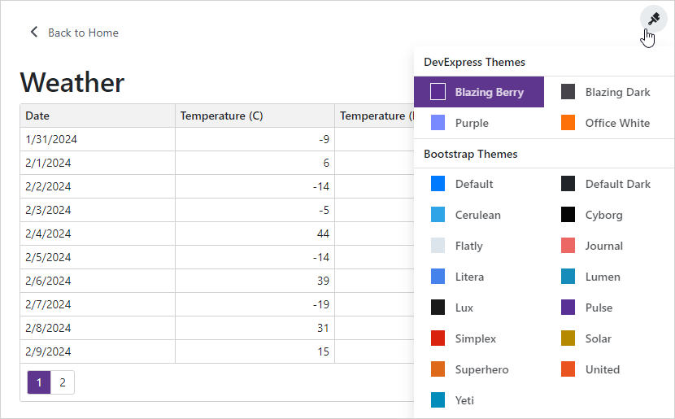

<!-- default badges list -->

<!-- default badges end -->
# How to implement a Theme Switcher in Blazor applications

This example demonstrates how to create a Theme Switcher as in [DevExpress Blazor Demos](https://demos.devexpress.com/blazor/) and apply the selected theme to an application dynamically. The example contains solutions both for Blazor Server and Blazor WebAssembly. Note that these solutions target .NET 5.0.

This Theme Switcher offers the standard Bootstrap theme, [3 DevExpress Bootstrap themes](https://github.com/DevExpress/bootstrap-themes), and [21 Bootstwatch themes](https://bootswatch.com/). 

## Files to look at

**Blazor Server**
* [ThemeSwitcher.razor](./CS/BlazorServer/BlazorAppThemes/Shared/ThemeSwitcher.razor)
* [ThemeSwitcher.razor.cs](./CS/BlazorServer/BlazorAppThemes/Shared/ThemeSwitcher.razor.cs)
* [MainLayout.razor](./CS/BlazorServer/BlazorAppThemes/Shared/MainLayout.razor)
* [Index.razor](./CS/BlazorServer/BlazorAppThemes/Pages/Index.razor)
* [site.css](./CS/BlazorServer/BlazorAppThemes/wwwroot/css/site.css)
* [switcher-resources](./CS/BlazorServer/BlazorAppThemes/wwwroot/css/switcher-resources) (folder)

**Blazor WebAssembly**
* [ThemeSwitcher.razor](./CS/BlazorWebAssembly/BlazorAppThemes/Shared/ThemeSwitcher.razor)
* [ThemeSwitcher.razor.cs](./CS/BlazorWebAssembly/BlazorAppThemes/Shared/ThemeSwitcher.razor.cs)
* [MainLayout.razor](./CS/BlazorWebAssembly/BlazorAppThemes/Shared/MainLayout.razor) 
* [Index.razor](./CS/BlazorWebAssembly/BlazorAppThemes/Pages/Index.razor) 
* [site.css](./CS/BlazorWebAssembly/BlazorAppThemes/wwwroot/css/site.css) 
* [switcher-resources](./CS/BlazorWebAssembly/BlazorAppThemes/wwwroot/css/switcher-resources) (folder)

